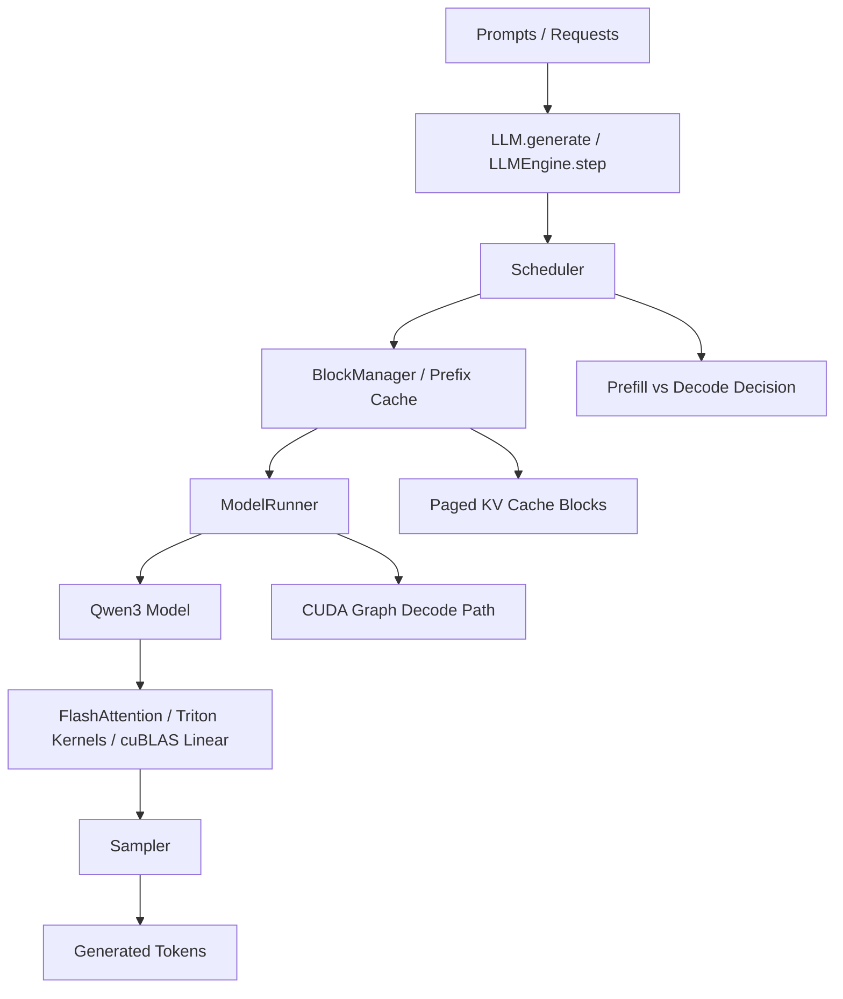

<p align="center">

</p>

<p align="center">
<a href="https://trendshift.io/repositories/15323" target="_blank"></a>
</p>

# Nano-vLLM Inference Optimization Fork

This repository is a lightweight LLM inference engineering project based on
[nano-vLLM](https://github.com/GeeeekExplorer/nano-vllm). The goal is not to turn a small codebase
into a full production serving stack. The goal is to make the core inference-engine tradeoffs visible:
prefill vs decode, scheduler behavior, paged KV-cache allocation, prefix caching, CUDA Graph replay,
FlashAttention integration, Triton kernels, cuBLAS baselines, and profile-first backend decisions.

Project framing:

> Lightweight LLM Inference Engine Optimization based on nano-vLLM, focused on decode bottleneck
> analysis, KV-cache observability, model-shape-aware backend/kernel policy, and end-to-end benchmark
> methodology.

The default serving path stays conservative: FlashAttention 2 for attention, model-dtype KV cache,
and PyTorch/cuBLAS Linear. Custom Triton and CUDA kernels are benchmarked, tested, and documented
before any runtime default is changed.

## Project Overview

This fork extends nano-vLLM in five areas:

| Area | What this fork adds |
|---|---|
| Engine observability | KV-cache block stats, prefix-cache hit/miss counters, backend config in benchmark output |
| Benchmark methodology | TTFT, ITL, prefill/decode time, decode tokens/s, peak memory, repeat/p50/p95 reporting |
| Kernel study | Model-shape-aware Triton benchmarks for Qwen3 shapes and CUDA GEMM worklog versus cuBLAS |
| Profiling evidence | PyTorch profiler trace/summary to identify whether bottlenecks are GEMM, attention, norms, sampling, or scheduler overhead |
| Engineering documentation | Reproducible RTX 5090 / Qwen3-4B results, upstream comparison, kernel policy report, serving roadmap |

## Architecture Overview



Runtime flow:

1. `LLM.generate()` converts prompts into `Sequence` objects.
2. `Scheduler.schedule()` chooses prefill or decode and enforces batch/token budgets.
3. `BlockManager` allocates paged KV-cache blocks and checks full-block prefix-cache reuse.
4. `ModelRunner` prepares tensors, runs Qwen3, optionally replays CUDA Graphs for decode, and calls the sampler.
5. Attention uses FlashAttention varlen/paged KV APIs, while layer kernels and linear paths are measured separately.

## Optimization Methodology

This repo follows a profile-first loop:

```text
profile -> identify bottleneck -> microbenchmark -> correctness test -> e2e benchmark -> decide default vs experimental path
```

The important rule is restraint: a custom kernel is not a production replacement just because it exists.
If a Triton/CUDA path does not beat FlashAttention or cuBLAS on the measured workload, it stays as a
worklog or benchmark artifact.

## Benchmark Metrics

| Metric | Meaning |
|---|---|
| TTFT | Time to first generated token, including prompt prefill and first decode step |
| ITL | Inter-token latency during decode, reported in milliseconds per generated token |
| Decode tokens/s | Generated decode tokens divided by measured decode time |
| Prefill time | Time spent processing prompt tokens and writing KV cache |
| Decode time | Time spent generating new tokens after prefill |
| Peak GPU memory | `torch.cuda.max_memory_allocated()` during the benchmark run |
| KV-cache total blocks | Number of paged KV blocks allocated from available GPU memory |
| KV-cache used/free blocks | Runtime block usage from `BlockManager` |
| Block utilization | Used blocks divided by total blocks; max utilization is tracked across the run |
| Prefix-cache hit rate | Full KV block reuse hits divided by hits plus misses |

## Kernel / Backend Policy

| Component | Default policy | Experimental policy |
|---|---|---|
| Attention | FlashAttention 2 remains default | Custom attention only after correctness and e2e wins |
| Linear / GEMM | PyTorch `F.linear` / cuBLAS remains default | CUDA GEMM and Triton GEMM stay in benchmarks until faster |
| KV cache dtype | Model dtype, usually BF16 for Qwen3 | Quantized KV cache is not a current default path |
| RMSNorm / AddRMSNorm | Triton path is measured and tested | Keep torch fallback available |
| SiLU-and-Mul | Triton path is measured and tested | Shape-sensitive; benchmark before enabling broadly |
| RoPE | Triton path is measured and tested | Large-shape regressions are documented |
| KV-cache store variants | 1D Triton store remains the baseline in this fork | 2D/TMA-style experiments stay research-only |

## Results

Curated RTX 5090 / Qwen3-4B artifacts live in
[results/rtx5090_qwen3_4b](results/rtx5090_qwen3_4b/README.md).

Measured on a single RTX 5090 with Qwen3-4B, prompt length 512, 4 prompts, 128 generated tokens,
`--enforce-eager`, 1 warmup run, and 3 measured runs:

| Metric | Upstream nano-vLLM | This fork | Delta |
|---|---:|---:|---:|
| Elapsed time | 5.5611 s | 3.2961 s | 1.687x lower |
| Decode tokens/s | 92.9235 | 160.2852 | 1.725x higher |
| Average ITL | 10.7815 ms | 6.3258 ms | 1.704x lower |
| Decode step p95 | 45.6434 ms | 25.9239 ms | 1.761x lower |
| Peak GPU memory | 27.4288 GB | 27.3754 GB | 1.002x lower |

Prefix-cache workloads make KV-cache behavior visible instead of treating it as hidden engine state.
Compared with a no-shared-prefix workload, a shared few-shot prefix reduces TTFT from 374.4 ms to
65.3 ms and improves decode throughput from 115.9 to 168.8 tokens/s. This is the serving-system reason
to expose prefix hits, misses, hit rate, and block utilization in benchmark output.

Profiler evidence for the same Qwen3-4B workload shows that decode time is dominated by BF16
Linear/GEMM work. In a 64-step PyTorch profiler trace, `aten::mm` accounts for about 422 ms of CUDA
time across 9,280 calls, while FlashAttention decode kernels account for about 27 ms combined. This is
why the next serious kernel track is BF16 Tensor Core GEMM rather than a blind attention rewrite.

Key result files:

| File | Purpose |
|---|---|
| [kernels_qwen3_4b_5090.md](results/rtx5090_qwen3_4b/kernels_qwen3_4b_5090.md) | Model-shape-aware Triton/cuBLAS microbenchmarks |
| [cuda_gemm_qwen3_4b_5090.md](results/rtx5090_qwen3_4b/cuda_gemm_qwen3_4b_5090.md) | CUDA naive/tiled GEMM worklog versus cuBLAS |
| [e2e_qwen3_4b_5090_repeat3.md](results/rtx5090_qwen3_4b/e2e_qwen3_4b_5090_repeat3.md) | Repeat e2e benchmark with mean/p50/p95 |
| [prefix_cache_qwen3_4b_5090.md](results/rtx5090_qwen3_4b/prefix_cache_qwen3_4b_5090.md) | Prefix-cache workload benchmark, generated from `bench_prefix_cache.py` |
| [profile_qwen3_4b_5090.md](results/rtx5090_qwen3_4b/profile_qwen3_4b_5090.md) | PyTorch profiler top-ops summary |
| [upstream_vs_fork_qwen3_4b_5090.md](results/rtx5090_qwen3_4b/upstream_vs_fork_qwen3_4b_5090.md) | Upstream vs fork e2e comparison |
| [KERNEL_POLICY_REPORT.md](results/rtx5090_qwen3_4b/KERNEL_POLICY_REPORT.md) | Generated backend/kernel policy report |

## Installation

For local development, clone this fork and install it in editable mode:

```bash
git clone https://github.com/Creativecole/nano-vllm.git
cd nano-vllm
pip install -e .
```

Or install directly from this fork:

```bash
pip install git+https://github.com/Creativecole/nano-vllm.git
```

Download an example model:

```bash
hf download Qwen/Qwen3-0.6B --local-dir ../models/Qwen3-0.6B
hf download Qwen/Qwen3-4B --local-dir ../models/Qwen3-4B
```

Hybrid checkpoints with `linear_attn` weights need a separate model adapter and are intentionally
rejected by this fork.

## Quick Start

```python
from nanovllm import LLM, SamplingParams

llm = LLM(
    "/YOUR/MODEL/PATH",
    enforce_eager=True,
    tensor_parallel_size=1,
)
sampling_params = SamplingParams(temperature=0.6, max_tokens=256)
outputs = llm.generate(["Hello, Nano-vLLM."], sampling_params)
outputs[0]["text"]
```

## How To Reproduce

Run CPU-safe and GPU kernel tests:

```bash
pytest tests/test_block_manager.py
pytest tests/test_kernels.py
NANOVLLM_TEST_MODEL=../models/Qwen3-0.6B pytest tests/test_integration.py -q
```

Run model-shape-aware kernel microbenchmarks:

```bash
python bench_kernels.py \
  --model ../models/Qwen3-4B \
  --min-run-time 1.0 \
  --skip-sampler \
  --output results/rtx5090_qwen3_4b/kernels_qwen3_4b_5090.md
```

Run CUDA GEMM worklog benchmarks:

```bash
python bench_cuda_gemm.py \
  --model ../models/Qwen3-4B \
  --min-run-time 1.0 \
  --output results/rtx5090_qwen3_4b/cuda_gemm_qwen3_4b_5090.md
```

Run end-to-end generation benchmark with Markdown and JSON output:

```bash
python bench_e2e.py \
  --model ../models/Qwen3-4B \
  --prompt-len 512 \
  --num-prompts 4 \
  --max-new-tokens 128 \
  --enforce-eager \
  --warmup 1 \
  --repeat 3 \
  --save-md results/rtx5090_qwen3_4b/e2e_qwen3_4b_5090_repeat3.md \
  --save-json results/rtx5090_qwen3_4b/e2e_qwen3_4b_5090_repeat3.json
```

Run prefix-cache workloads:

```bash
python bench_prefix_cache.py \
  --model ../models/Qwen3-4B \
  --prompt-len 512 \
  --num-prompts 4 \
  --max-tokens 128 \
  --enforce-eager \
  --save-md results/rtx5090_qwen3_4b/prefix_cache_qwen3_4b_5090.md \
  --save-json results/rtx5090_qwen3_4b/prefix_cache_qwen3_4b_5090.json
```

Capture a PyTorch profiler trace:

```bash
python profile_e2e.py \
  --model ../models/Qwen3-4B \
  --prompt-len 512 \
  --num-prompts 4 \
  --max-tokens 128 \
  --enforce-eager \
  --profile-steps 64 \
  --profile-memory \
  --record-shapes \
  --trace-output results/rtx5090_qwen3_4b/profile_qwen3_4b_5090.json \
  --summary-output results/rtx5090_qwen3_4b/profile_qwen3_4b_5090.md
```

Compare against an upstream checkout:

```bash
cd ..
git clone https://github.com/GeeeekExplorer/nano-vllm.git nano-vllm-upstream
cd nano-vllm
python compare_upstream.py \
  --upstream-repo ../nano-vllm-upstream \
  --model ../models/Qwen3-4B \
  --prompt-len 512 \
  --num-prompts 4 \
  --max-tokens 128 \
  --enforce-eager \
  --warmup 1 \
  --repeat 3 \
  --output results/rtx5090_qwen3_4b/upstream_vs_fork_qwen3_4b_5090.md
```

Generate the backend/kernel policy report:

```bash
python analyze_kernel_results.py \
  --kernel-results results/rtx5090_qwen3_4b/kernels_qwen3_4b_5090.md \
  --cuda-gemm-results results/rtx5090_qwen3_4b/cuda_gemm_qwen3_4b_5090.md \
  --e2e-results results/rtx5090_qwen3_4b/e2e_qwen3_4b_5090.md \
  --output results/rtx5090_qwen3_4b/KERNEL_POLICY_REPORT.md \
  --policy-output results/rtx5090_qwen3_4b/kernel_policy_5090.json
```

## Script Map

| Script | Role |
|---|---|
| `bench_e2e.py` | End-to-end scheduler-loop benchmark with TTFT/ITL/KV stats |
| `bench_prefix_cache.py` | Prefix-cache behavior benchmark across prompt-sharing workloads |
| `bench_kernels.py` | Triton microbenchmarks using Qwen model shapes |
| `bench_cuda_gemm.py` | CUDA C++ GEMM worklog versus cuBLAS |
| `profile_e2e.py` | PyTorch profiler trace and top-op summary |
| `compare_upstream.py` | Same-workload upstream vs fork comparison |
| `analyze_kernel_results.py` | Markdown/JSON kernel policy report generator |

## Serving Roadmap

See [docs/serving_roadmap.md](docs/serving_roadmap.md) for the optional online serving plan. The
current project remains focused on offline inference benchmarking and kernel/backend analysis.

## Star History

[](https://www.star-history.com/#GeeeekExplorer/nano-vllm&Date)
