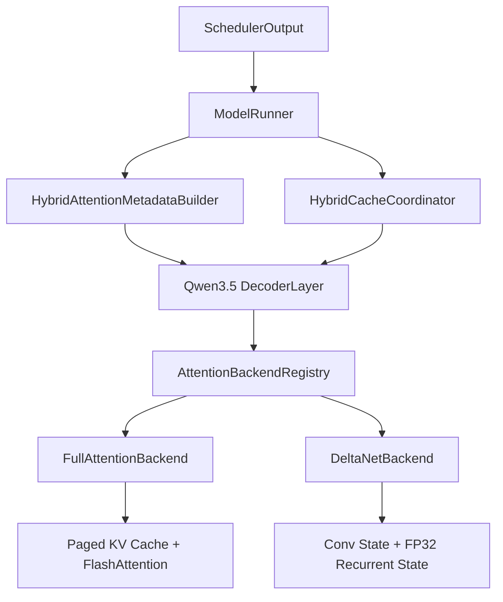

# Hybrid Attention Runtime

## Motivation

The original Qwen3.5 path selected Full Attention or Gated DeltaNet directly inside
each decoder layer. Paged KV allocation lived in `ModelRunner`, while request-scoped
DeltaNet state used a separate manager. Execution metadata was read through a global
context object, which made another sequence mixer harder to add without extending
model-specific branches.

The refactor keeps the existing scheduler, kernels, cache layout, and model math. It
separates four responsibilities:

1. `Scheduler` decides which requests and tokens run.
2. `HybridAttentionMetadataBuilder` creates typed metadata for one model step.
3. `HybridCacheCoordinator` owns physical paged-KV tensors and DeltaNet state slots.
4. Registered attention backends execute a layer against its typed metadata and state.

## Runtime Flow

## Metadata

`CommonExecutionMetadata` records request IDs, per-request query lengths, per-request
prefill/decode mode, packed token count, and positions. The builder then creates:

- `FullAttentionMetadata`: slot mapping, block tables, context lengths, and varlen
  prefill offsets.
- `DeltaNetMetadata`: packed query lengths, prefill sequence lengths, and the mixed
  batch decode prefix.

The builder currently adapts the legacy nano-vLLM context at the `ModelRunner`
boundary. Qwen3.5 backends receive typed metadata directly and do not need to read the
global context. The legacy context remains for Qwen3 and logits selection during this
incremental migration.

## Backend Registry

Qwen3.5 layer construction uses `config.layer_types` to look up a registered backend:

| Layer type | Backend | Preserved module name |
|---|---|---|
| `full_attention` | `FullAttentionBackend` | `self_attn` |
| `linear_attention` | `DeltaNetBackend` | `linear_attn` |

The module names are preserved so official checkpoint keys do not change. A backend
defines mixer execution, metadata validation, state specification, and optional
runtime binding. Request allocation and release are deliberately not backend methods;
those operations belong to the cache coordinator.

## State Ownership

`HybridCacheCoordinator` composes the existing state implementations:

- `PagedKVState` is shared physical storage indexed by scheduler-managed block tables.
- `DeltaNetState` is request-scoped convolution and recurrent state managed by compact
  resident slots with a gather/commit fallback.

The scheduler continues to account token capacity using Full Attention KV blocks.
DeltaNet state capacity remains an independent per-request admission constraint.

## Compatibility

This refactor intentionally preserves:

- Qwen3.5 Full Attention and DeltaNet equations.
- Chunked and batched DeltaNet prefill.
- Resident DeltaNet state optimization.
- Paged KV cache layout and BlockManager accounting.
- Existing profiler range names and benchmark interfaces.
- Official `self_attn` and `linear_attn` checkpoint prefixes.

The next backend can be added through the registry and a typed metadata/state contract
without adding another execution branch to `Qwen3_5DecoderLayer`.

## Extension Boundary

- Mamba-style mixers would add a state spec, typed metadata, and registered backend.
- MLA would add an attention metadata/state contract without changing scheduler output.
- FlashInfer can be another Full Attention backend implementation behind the same
  paged-KV metadata.
- TensorRT-LLM is not a drop-in layer backend at this boundary; integrating it would
  also require a different model executor and engine handoff.
